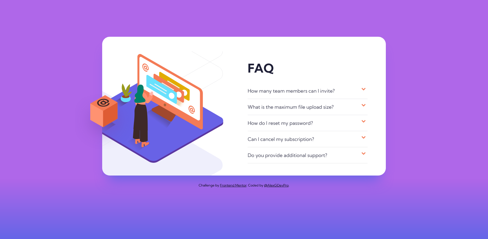
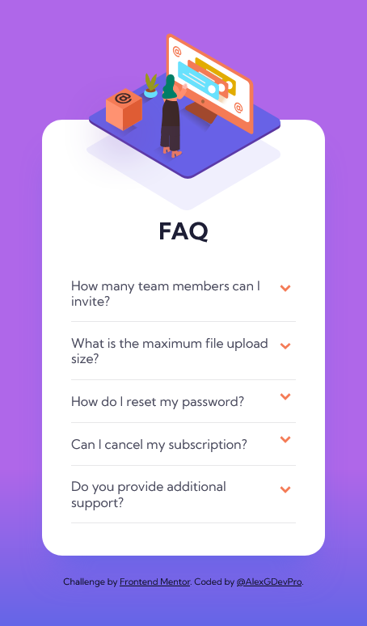

# Frontend Mentor - FAQ accordion card solution

This is a solution to the [FAQ accordion card challenge on Frontend Mentor](https://www.frontendmentor.io/challenges/faq-accordion-card-XlyjD0Oam). Frontend Mentor challenges help you improve your coding skills by building realistic projects.

## Table of contents

- [Overview](#overview)
  - [The challenge](#the-challenge)
  - [Screenshot](#screenshot)
  - [Links](#links)
- [My process](#my-process)
  - [Built with](#built-with)
  - [What I learned](#what-i-learned)
- [Author](#author)

## Overview

### The challenge

Users should be able to:

- View the optimal layout for the component depending on their device's screen size
- See hover states for all interactive elements on the page
- Hide/Show the answer to a question when the question is clicked

### Screenshot

- Desktop view

- Mobile view

### Links

- Solution URL: [https://www.frontendmentor.io/solutions/mobile-first-custom-bootstrap-accordion-zsQLZZqJe](https://www.frontendmentor.io/solutions/mobile-first-custom-bootstrap-accordion-zsQLZZqJe)
- Live Site URL: [https://alexgdevpro.github.io/FEM_Ch.-6_FAQ-accordion-card-main/](https://alexgdevpro.github.io/FEM_Ch.-6_FAQ-accordion-card-main/)

## My process

### Built with

- [Bootstrap](https://getbootstrap.com/)
- Mobile-first workflow
- Semantic HTML5 markup
- CSS custom properties

### What I learned

I've never done accordion before, so I found a good idea to start with the one in BS, and also improved my skills on relative and absolute placements.

## Author

- Website - [https://alexgdevpro.github.io/](https://alexgdevpro.github.io/)
- Frontend Mentor - [@AlexGDevPro](https://www.frontendmentor.io/profile/AlexGDevPro)
- Twitter - [@AlexGDevPro](https://twitter.com/AlexGDevPro)
